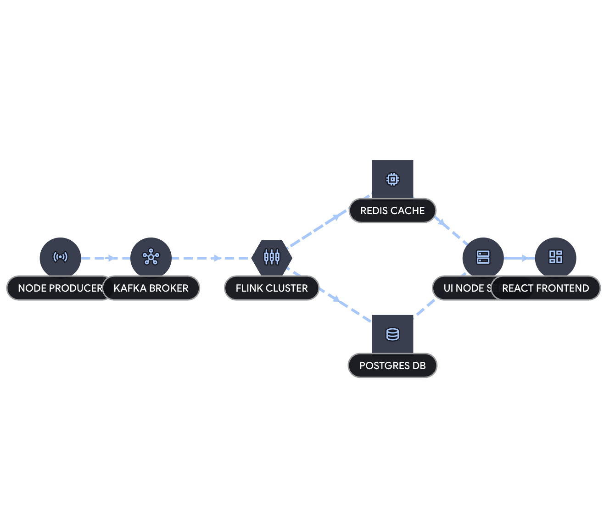

# Real-Time Analytics Pipeline

A production-grade, fault-tolerant event processing pipeline demonstrating a modern Lambda architecture. This system ingests, processes, and visualizes high-throughput telemetry streams in real-time while maintaining a durable historical ledger.

Built with **Apache Kafka**, **Apache Flink**, **Redis**, **PostgreSQL**, **Node.js**, and **React**.




---

## Overview

This project simulates a distributed operations grid (e.g., a ride-sharing platform). It generates randomized user events, processes them via stateful tumbling windows, and routes the data to dual sinks:

1. **The Hot Path (Redis):**  
   Sub-second live aggregations, rolling time-series history, and HyperLogLog unique user counts streamed via Server-Sent Events (SSE) to a live React dashboard.

2. **The Cold Path (PostgreSQL):**  
   Durable, batched historical data dual-written for complex queries and long-term analysis.

For a deep dive into the system design, data flow, and technology rationale, see the [Architecture Document](ARCHITECTURE.md).

---

## Features

- **Event-Time Processing:** Uses Flink watermarking to handle delayed or out-of-order data.
- **Fault Tolerance:** Distributed checkpointing enables exactly-once processing semantics.
- **Multi-Dimensional Analytics:** Aggregates telemetry by geography and revenue in 10-second tumbling windows.
- **Memory Optimization:** HyperLogLog estimates unique users efficiently without unbounded memory growth.
- **Modern UI:** Responsive React SPA using `react-chartjs-2` for smooth visualizations.

---

## Quick Start

### Prerequisites

- Docker
- Docker Compose

---

### Running the Cluster

The entire distributed ecosystem is containerized and orchestrated via Docker Compose.

#### 1. Clone the repository

```bash
git clone https://github.com/yahyakhaan/realtime-analytics.git
cd realtime-analytics
```

#### 2. Build and start the infrastructure

```bash
docker compose up --build -d
```

> **Note:** The initial build may take a few minutes as it downloads dependencies and compiles the Flink Fat JAR.

#### 3. Verify services are running

```bash
docker compose ps
```

---

### Accessing the Interfaces

- **Live Dashboard (React):** http://localhost:3000
- **Apache Flink UI:** http://localhost:8081

---

### Shutting Down

#### Stop the cluster

```bash
docker compose down
```

#### Remove containers and volumes (fresh reset)

```bash
docker compose down -v
```

---

## Directory Structure

```
/flink-processor   # Java/Gradle app with Flink stream processing logic, sinks, POJOs
/postgres          # SQL initialization scripts for the historical database schema
/producer          # Node.js service generating randomized Kafka events
/ui                # Full-stack dashboard (Express API + React frontend)

docker-compose.yml # Infrastructure orchestration
```

---

## License

MIT License
